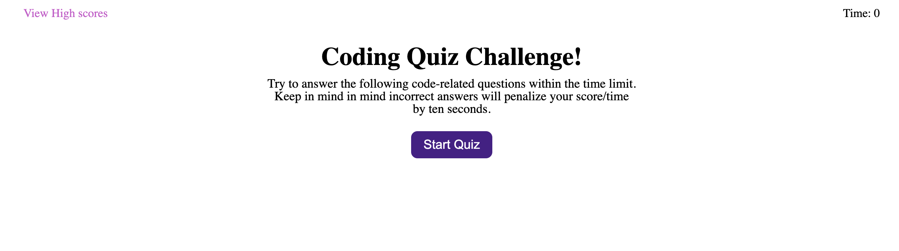

# JavaScript Coding Quiz

Quiz that has a timer and new question set up with JavaScript, with JavaScript questions. Then saves scores with your initials on a new page. 

## Demo

https://jessangarcia.github.io/coding-quiz/

  
## Photo

  
## Contributing

Some code is from the UofU GitLab, comments say which part I used this at